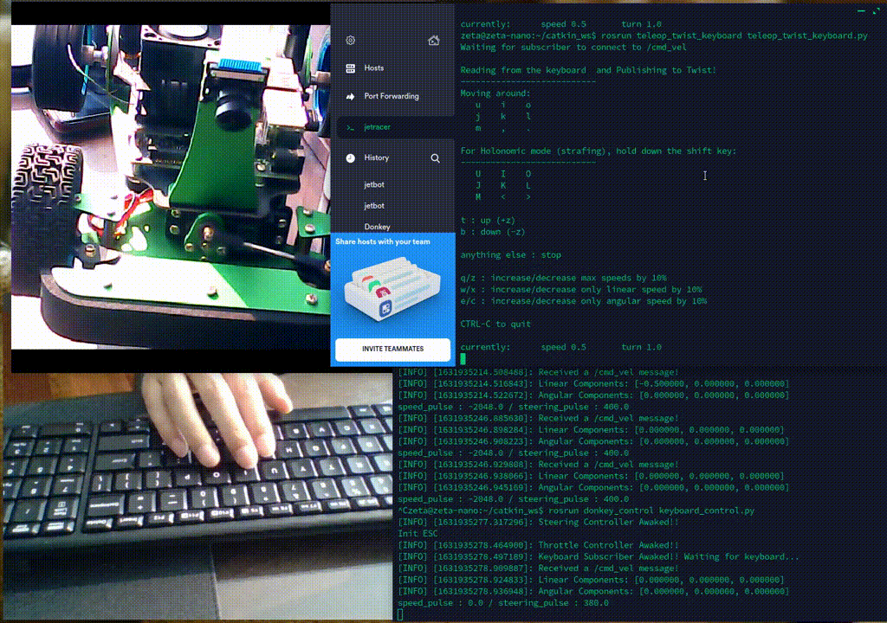
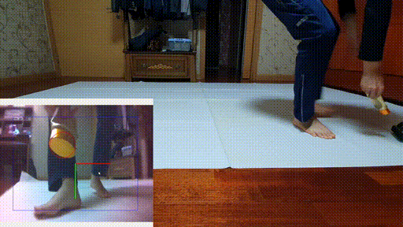

# Monicar I    

## AI RC Car with ROS2 Galactic + OpenCV + Yolo4-tiny

Base code: https://github.com/Road-Balance/donkey_ros      

There's Notion Lecture Notes but, It's written in Korean. 
Anyway, Here's the link

* [Notion Lecture Notes] https://zeta7.notion.site/JessiCar-1449b3fd5c984bab816920cb2b92002d

## Tested System information

**Jetson Nano 4GB or 2GB + IMX219 160 CSI camera**
* Jetpack 4.5.1 download
* Ubuntu 20.24
* ROS2 Galactic
* Opencv3.4.6 downgrade for darknet_ros

## Packages with Brief Explanation
``` bash    
|__ ros2_ws
    |__ install
        |__ monicar_cv
            |__ lib
                |__ python3.8
                    |__ site-packages
                        |__ monicar_cv
                            |__ csicam_video_node   super().__init__('csicam_video_node')
                |__ monicar_cv
                    |__ csi_pub
                    |__ csi_pub_video  # csicam.launch-modify
                    |__ find_ball
                    |__ usbcam_pub
            |__ share
                |__ monicar_cv
                    |__ launch
                        |__ csicam_video.launch.py  # csicam.launch.py-modify
                        |__ csicam.launch.py
                        |__ blob_detect.launch.py
         |__ monicar_control
             |__lib
                |__ monicar_control
                     |__motrol_control
                     |__chase_traffic_yolo
                     |__chase_the_ball
                     |__chase_object_yolo
                     |__joy_control
                |__lib
                   |__motrol_control
                      |__lib
                         |__submodules
                         |__lib
                         |__motor_control.py # steering is or not

             |__share
                |__ monicar_control
                     |__launch
                        |__motrol_launch.py
                        |__chase_traffic_yolo
                        |__chase_the_ball.launch.py
                        |__yolo_all.launch.py
                        |__jyolo_traffic.launch.py
                     |__param
                        |__motor.pca9685Steer.yaml

             |__motrol_control
             |__chase_traffic_yolo
             |__chase_the_ball
             |__chase_object_yolo
             |__csi_pub

    |__ build
        |__ monicar_cv
            |__ build
                |__ lib
                    |__ monicar_cv
                        |__ csi_pub.py
                        |__ csi_pub_video.py # csi_pub.py modify   super().__init__('csicam_video_node')
                        |__ find_ball.py
                        |__ usbcam_pub.py
       
    |__ src
        |__ monicar
            |__ monicar_cv
                |__ launch 수정 'csi_pub_video', name='csicam_video_node',
                |__  setup.py entry_points 부분 수정
                |__monicar_cv
                   |__monicar_cv
                      |__ csi_pub.py
                      |__ find_ball.py
                      |__ __init.py
                      |__ usbcam_pub.py
                      |__ csi_pub_video.py
             |__ monicar_control
                |__  setup.py entry_points 부분 수정

   ```
   ``` bash      
       entry_points={
        'console_scripts': [
            'blob_chase = monicar_control.blob_chase:main',
            'chase_the_ball = monicar_control.chase_the_ball:main', 
            'joy_control = monicar_control.joy_control:main',
            'motor_control = monicar_control.motor_control:main',
            'chase_object_yolo = monicar_control.chase_object_yolo:main', 
            'chase_traffic_yolo = monicar_control.chase_traffic_yolo:main', 
            'csi_pub = monicar_cv.csi_pub:main',
            'csi_pub_video = monicar_cv.csi_pub_video:main',
        ],
    },                  
  ```

```           
    ├── monicar_teleop => Publish cmd_vel from keyboard/gamepad

(...)
├── Images
├── LICENSE
├── README.md
```
##### motor.launch.py 프로그램을 변경한다. 원래 코드는 단순한 모터 제어지만 아래 코드는 모터 제어, 영상 취득, 이미지 저장 기능이 있다   ros2 launch monicar_control motor.launch.py home/jetson/ros2_ws/src/monicar/monicar_control/launch 
``` bash

#!/usr/bin/env python3
import os
from launch_ros.actions import ComposableNodeContainer
from launch_ros.descriptions import ComposableNode  # Only if you use ComposableNode


from ament_index_python.packages import get_package_share_directory
from launch import LaunchDescription
from launch.actions import DeclareLaunchArgument
from launch_ros.actions import Node


def generate_launch_description():
    # 모터 설정
    motor_parameter = LaunchConfiguration(
        'motor_parameter',
        default=os.path.join(
            get_package_share_directory('monicar_control'),
            'param/motor.yaml'
        )
    )
  
    # CSI 카메라 노드 설정
    camera_node = ComposableNode(
        package='v4l2_camera',
        plugin='v4l2_camera::V4L2Camera',
        name='csi_camera',
        namespace='',
        parameters=[{
            'video_device': '/dev/video0',  # 비디오 디바이스 경로 확인 필요
            'pixel_format': 'UYVY',  # 카메라에서 지원하는 픽셀 포맷으로 설정
            'image_size': [1920, 1080],  # 해상도 설정
            'framerate': 30  # 프레임레이트 설정
        }],
    )
  
    # 컴포저블 노드 컨테이너 생성
    container = ComposableNodeContainer(
        name='camera_container',
        namespace='',
        package='rclcpp_components',
        executable='component_container',
        composable_node_descriptions=[camera_node],
        output='screen'
    )
  
    # 이미지 저장 노드 설정
    image_saver_node = Node(
        package='image_view',
        executable='image_saver',
        name='image_saver',
        remappings=[
            ('image', '/csi_camera/image_raw')
        ],
        arguments=['_save_all_image:=true', '_filename_format:=/home/jetson/ros2_ws/save/image%04i.jpg']
    )

    return LaunchDescription([
        DeclareLaunchArgument('motor_parameter', default_value=motor_parameter),
        Node(
            package='monicar_control', executable='motor_control', name='motor_control_node',
            output='screen', emulate_tty=True,
            parameters=[motor_parameter],
        ),
        container,
        image_saver_node
    ])
```
``` bash
sudo apt update
sudo apt install ros-galactic-image-view
```
``` bash
import launch
from launch import LaunchDescription
from launch.actions import DeclareLaunchArgument
from launch.substitutions import LaunchConfiguration
```
``` bash
cd ~/ros2_ws
colcon build --packages-select monicar_control
source install/setup.bash
```
### 수정된 내용 build

``` bash
cd ~/ros2_ws
colcon build --packages-select monicar_cv
source install/setup.bash
jetson@nano:~/ros2_ws/src/monicar/monicar_cv/monicar_cv$ chmod +x csi_pub_video.py
                                                            chmod +x csicam_video.launch.py
```
``` bash
mkdir -p /home/jetson/ros2_ws/save
ls -l /home/jetson/ros2_ws/
chmod -R 777 /home/jetson/ros2_ws/save
terminal 1
ros2 launch monicar_control motor.launch.py
terminal 2

ros2 launch monicar_teleop teleop_joy.launch.py

terminal 3

ros2 topic echo /csi_camera/image_raw

```
#####  and camera test
``` bash
#if csi camera
$ ros2 launch monicar_cv csicam.launch.py
# if usb camera
$ ros2 launch monicar_cv usbcam.launch.py

# terminal #2
$ ros2 run rqt_image_view rqt_image_view

# terminal 1.   
$ ros2 launch monicar_cv csicam_video.launch.py

# terminal #2
$ ros2 run rqt_image_view rqt_image_view
```

## Prerequisite
Clone these Repo

``` bash
$ cd ~/ros2_ws/src

monicar project code   
$ git clone https://github.com/zeta0707/monicar.git   

darknet_ros
$ git clone --recursive https://github.com/zeta0707/darknet_ros_fp16.git
$ darknet_ros_fp16/darknet_ros/rm_darknet_CMakeLists.sh
```

## Run script for selecting RCcar type
```bash
./jetRccarParam.sh 
Usage: ./jetRccarParam.sh target
target: select one among these
jetracer, jetbot, motorhat2wheel, motorhatSteer, nuriBldc, 298n2Wheel, pca9685Steer 
```

if you select waveshare jetracer
```bash
$ cd ~/catkin_ws/src/monicar/script
$ ./jetRccarParam.sh jetracer
```

## Run script for selecting Camera type
```bash
./camSelect.sh
Usage: ./camSelect.sh target
target: select one between these
csicam, usbcam
```

if you select usb caemra, run below command.
```bash
$ cd ~/ros2_ws/src/monicar/script
$ ./camSelect.sh usbcam
```

## Usage

### 1. **monicar_camera package**

Packages for Image Streaming

> Check Camera Connection First!!!

**Using Gstreamer for CSI camera**
```bash
gst-launch-1.0 nvarguscamerasrc sensor_id=0 ! \
   'video/x-raw(memory:NVMM),width=3280, height=2464, framerate=21/1, format=NV12' ! \
   nvvidconv flip-method=0 ! 'video/x-raw,width=960, height=720' ! \
   nvvidconv ! nvegltransform ! nveglglessink -e
```

* `sensor_id` : this value depends on Camera Slot in Jetson Nano.

**Using ROS python**
#### video capture, csi camera
``` bash
├── ros2_ws
├──────── install
           ├── monicar_cv        
                ├── launch ==> csicam_video.launch.py  
                           ==> csicam.launch.py 
                           ==> blob_detect.launch.py
                ├── share            
                     ├── monicar_cv
                          ├── launch ==> csicam_video.launch.py  
                                     ==> csicam.launch.py 
                                     ==> blob_detect.launch.py

|__ ros2_ws
    |__ install
        |__ monicar_cv
            |__ launch
                => csicam_video.launch.py
                => csicam.launch.py
                => blob_detect.launch.py
    |__ share
```
``` bash
 jetson@nano:~/ros2_ws$ ros2 launch monicar_cv csicam_video.launch.py
```


```bash
#if csi camera
$ ros2 launch monicar_cv csicam.launch.py
# if usb camera
$ ros2 launch monicar_cv usbcam.launch.py

# terminal #2
$ ros2 run rqt_image_view rqt_image_view
```

### 2. **monicar_control package**

Packages for controlling `RC Car` with `PCA9685` PWM driver.
You need to install `Adafruit_PCA9685` python package first 

There's four modes for controlling RC Car

* JoyStick Control
* Keyboard Control
* Blob, Yolo4 Control
* React to traffic signal 

### 3. **monicar_joy package**

There's two modes for using joystick 
* Button mode- delete Button mode

* Axes mode

### 4. **monicar_cv package**

Packages for OpenCV applications

* Find Blob with Certain color
#### 수정된 부분
* 조이스틱으로 조정하기 전에 영상을 저장하기위한 과정
* 
  ``` bash
  cd ros2_ws
  terminal 1
  ros2 launch monicar_cv csicam_video.launch.py

  terminal 2
  ros2 run image_view image_view --ros-args --remap /image:=/image_raw

```

## Application

### **1. joy_control**

Control RC Car with game controller

<p align="center">
    
</p>

``` bash
#jetson
$ ros2 launch monicar_control motor.launch.py
#jetson
$ ros2 launch monicar_teleop teleop_joy.launch.py
```

### **2. keyboard_control**

Control RC Car with keyboard

<p align="center">
    
</p>

``` bash
#jetson
$ ros2 launch monicar_control motor.launch.py
#jetson or PC
$ ros2 run monicar_teleop teleop_keyboard
```

### **3. blob_tracking**

Find the any color box of the Jetson Nano on the screen and change the direction of the wheel accordingly.

<p align="center">
    
</p>


``` bash
# Jetson
$ ros2 launch monicar_control blob_all.launch.py
```

Debugging with `rqt_image_view`

``` bash
# Jetson, but PC is better
ros2 run rqt_image_view rqt_image_view
```

### **4. Yolo4_tracking**

Find the object of the Jetson Nano on the screen and change the direction of the wheel accordingly.


<p align="center">
    
</p>


``` bash
#terminal #1
# object detect using Yolo_v4
$ ros2 launch darknet_ros yolov4-tiny.launch.py

#terminal #2
# camera publish, object x/y -> car move
$ ros2 launch monicar_control yolo_all.launch.py 
```

### **5. Yolo4 traffic signal**

Train traffic signal, then Jetson nano will react to the traffic signal


``` bash
#terminal #1
# object detect using Yolo_v4
$ ros2 launch darknet_ros yolov4-monicar.launch.py

#terminal #2
# camera publish, object -> start, stop, turn left, turn left
$ ros2 launch monicar_control traffic_all.launch.py
```
